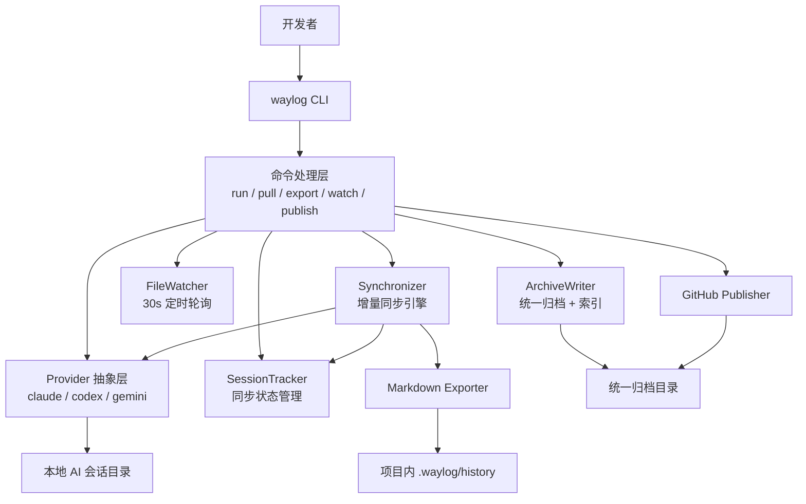
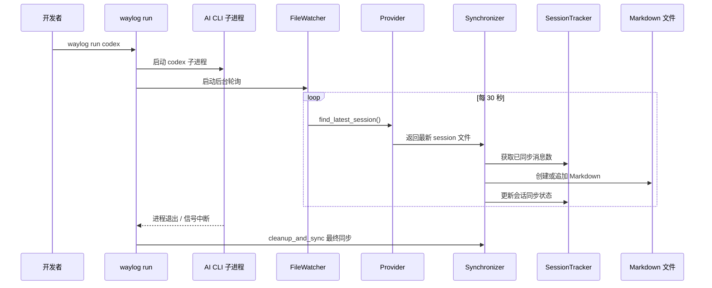
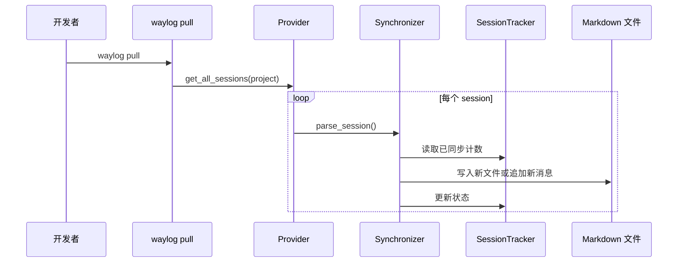

# WayLog CLI 项目总览

## 一. 项目概述

### 1. 项目简介

WayLog CLI 是一个使用 Rust 编写的本地命令行工具，用于把 Claude Code、Claude App、Codex CLI、Codex App、Gemini CLI 等本地 AI 会话数据同步为项目内 Markdown 历史与统一归档数据。它的定位不是替代 AI CLI，而是作为一层“历史沉淀、恢复与知识库归档”能力，让开发者把原本散落在各家工具私有目录里的聊天记录，统一沉淀到当前工程的 `.waylog/history/` 和长期复用的归档目录中。

### 2. 背景与目标

项目试图解决几个典型痛点：

- AI CLI 会话历史通常保存在各自工具的私有目录，项目上下文难以长期留存。
- 会话容易因为工具升级、目录切换、超时、误操作而丢失。
- 开发者希望把 AI 协作过程纳入本地版本管理和知识沉淀体系。

本项目的核心目标是：

- 在使用 AI CLI 的同时，持续把对话沉淀为可读、可搜索的 Markdown。
- 支持后补式恢复，把历史会话一次性拉回当前项目。
- 支持把全机范围的历史会话平铺导出到知识库目录。
- 支持把归档目录通过 GitHub token 发布到知识库仓库。
- 用统一抽象屏蔽不同 AI CLI / App 的存储结构差异。

### 3. 项目价值

- 为项目建立长期可追溯的 AI 协作日志。
- 降低跨工具迁移和会话丢失带来的上下文损耗。
- 让聊天历史能够直接进入 GitHub 知识库、文档系统或后续记忆管线。
- 以 Markdown + 原始文件 + 集中索引的形式输出，便于二次加工和自动化处理。

## 二. 项目目录结构

```plaintext
waylog-cli/
├── .github/
│   └── workflows/
│       ├── ci.yml                # CI：check / test / integration / fmt / clippy / build
│       └── release.yml           # 发布流程：crates.io、GitHub Release、Homebrew Formula
├── demo/
│   ├── run.gif                   # run 命令演示
│   ├── run.tape                  # run 录制脚本
│   ├── pull.gif                  # pull 命令演示
│   └── pull.tape                 # pull 录制脚本
├── scripts/
│   ├── install.sh                # 本地源码安装脚本
│   ├── test-ci-integration.sh    # CI 集成测试脚本
│   └── test-local-integration.sh # 本地集成测试脚本
├── src/
│   ├── main.rs                   # 程序入口：参数解析、初始化、命令分发、错误退出码
│   ├── cli.rs                    # CLI 参数与子命令定义（clap）
│   ├── init.rs                   # 项目根目录解析、日志初始化
│   ├── error.rs                  # 统一错误类型与退出码映射
│   ├── synchronizer.rs           # 通用同步引擎：按 session 增量写入 Markdown
│   ├── commands/
│   │   ├── mod.rs                # 命令导出
│   │   ├── export.rs             # 全机统一归档导出
│   │   ├── publish.rs            # GitHub token 发布归档
│   │   ├── pull.rs               # 批量拉取历史会话
│   │   ├── watch.rs              # 后台监听本地会话目录（App/原生命令行场景）
│   │   └── run/
│   │       ├── mod.rs            # 实时运行入口：启动子进程 + watcher
│   │       ├── process.rs        # 子进程终止与超时处理
│   │       └── cleanup.rs        # run 结束后的最终同步与清理
│   ├── archive/
│   │   ├── mod.rs                # 统一归档写入、索引重建、摘要生成
│   │   ├── layout.rs             # 归档路径和可读文件名生成
│   │   └── meta.rs               # 统一索引记录结构与增量判断
│   ├── providers/
│   │   ├── mod.rs                # provider 注册表与查找逻辑
│   │   ├── base.rs               # Provider trait 与通用会话/消息模型
│   │   ├── claude.rs             # Claude Code provider
│   │   ├── codex.rs              # Codex CLI provider
│   │   └── gemini.rs             # Gemini CLI provider
│   ├── github/
│   │   └── mod.rs                # GitHub API 发布客户端（token / tree / commit / ref）
│   ├── session/
│   │   ├── mod.rs                # SessionTracker 导出
│   │   ├── state.rs              # 会话同步状态模型
│   │   └── tracker/
│   │       ├── mod.rs            # 会话同步状态管理
│   │       └── restore.rs        # 从已有 Markdown frontmatter 恢复状态
│   ├── exporter/
│   │   ├── mod.rs                # 导出入口
│   │   ├── frontmatter.rs        # frontmatter 解析
│   │   └── markdown/
│   │       ├── mod.rs            # Markdown 生成与追加
│   │       └── formatter.rs      # 单条消息、标题、时间格式化
│   ├── output/
│   │   ├── mod.rs                # 统一终端输出层（text/json/quiet）
│   │   ├── init.rs               # 初始化提示输出
│   │   ├── pull.rs               # pull 命令输出
│   │   └── run.rs                # run 命令输出
│   ├── watcher/
│   │   ├── mod.rs                # watcher 导出
│   │   └── file_watcher.rs       # 定时轮询同步器（每 30 秒）
│   └── utils/
│       ├── mod.rs                # 工具模块导出
│       ├── path.rs               # 路径解析、编码、目录定位
│       ├── string.rs             # 文件名 slug 生成
│       └── time.rs               # 本地时间/显示时间/归档时间格式化
├── Cargo.toml                    # Rust 包定义与依赖
├── Cargo.lock                    # 依赖锁文件
├── build.rs                      # 构建时生成 man page
├── README.md                     # 英文说明
├── README_zh.md                  # 中文说明
├── LICENSE                       # Apache-2.0 许可证
└── .pre-commit-config.yaml       # pre-commit：fmt / clippy / test
```

补充说明：

- 项目运行时会在业务工程目录下创建 `.waylog/`，其中：
  - `.waylog/history/` 保存 Markdown 会话记录。
  - `.waylog/logs/` 在 `--verbose` 时保存每日滚动日志。
- 仓库里可能出现 `.omx/`，这是 Codex/OMX 的本地运行状态目录，不属于 WayLog CLI 的核心产物。

## 三. 技术栈

### 1. 编程语言

- Rust 2021

### 2. 核心库与框架

- `clap`：命令行参数解析
- `tokio`：异步运行时、异步文件与子进程处理
- `serde` / `serde_json`：JSON / JSONL 解析
- `async-trait`：异步 trait
- `chrono`：时间处理
- `reqwest`：GitHub API 上传
- `base64`：GitHub blob 内容编码
- `thiserror` / `anyhow`：错误建模
- `tracing` / `tracing-subscriber` / `tracing-appender`：日志系统
- `termcolor` / `console` / `indicatif`：终端输出、颜色与进度条
- `walkdir`：递归扫描目录
- `which`：检查外部 CLI 是否已安装
- `sha2`：Gemini 项目路径哈希编码
- `uuid`：消息 ID 兜底生成
- `regex`：Claude 内部 IDE 标签过滤
- `human-panic`：用户友好的 panic 输出

### 3. 工具链与工程化

- Cargo：构建、测试、发布
- `build.rs` + `clap_mangen`：生成 man page
- GitHub Actions：CI 与发布流水线
- pre-commit：本地格式化、静态检查、测试钩子

### 4. 外部工具集成

WayLog 优先读取本地 AI CLI / App 的会话文件，并在 `run` 模式下作为这些 CLI 的启动壳；在 `publish` 模式下会调用 GitHub API：

- Claude Code
- Claude App（通过本地 `~/.claude/projects/**/*.jsonl` transcript）
- OpenAI Codex CLI
- Codex App（通过本地 `~/.codex/sessions/**/*.jsonl` transcript）
- Gemini CLI
- GitHub Contents / Git Data API（用于归档发布）

## 四. 🚀 Quick Start

### 1. 安装方式

#### 方式一：Homebrew

```bash
brew install shayne-snap/tap/waylog
```

#### 方式二：Scoop（Windows）

```powershell
scoop bucket add waylog https://github.com/shayne-snap/scoop-bucket
scoop install waylog
```

#### 方式三：Cargo

```bash
cargo install waylog
```

#### 方式四：源码安装

```bash
git clone https://github.com/shayne-snap/waylog-cli.git
cd waylog-cli
./scripts/install.sh
```

### 2. 快速体验

#### 实时记录会话

```bash
waylog run claude
waylog run codex
waylog run gemini
```

用途：

- WayLog 会启动对应的 AI CLI 子进程。
- 后台启动定时同步任务，默认每 30 秒同步一次最新会话。
- 退出时执行一次最终同步，确保最后一轮对话被落盘。

#### 后台监听 App / 原生命令行会话

```bash
waylog watch --archive-dir ~/waylog-archive
waylog watch --provider claude --archive-dir ~/waylog-archive
waylog watch --provider codex --archive-dir ~/waylog-archive
```

用途：

- 不通过 `waylog run` 启动时，持续监听本地会话目录。
- 适用于 Claude App、Codex App 或直接运行原生命令行工具的场景。
- 默认每 30 秒轮询一次并更新统一归档目录。

#### 批量恢复历史

```bash
waylog pull
```

用途：

- 扫描当前项目对应的 provider 会话目录。
- 把所有相关历史会话同步到当前项目的 `.waylog/history/`。

#### 指定 provider

```bash
waylog pull --provider claude
waylog pull --provider codex
waylog pull --provider gemini
```

#### 全机统一归档

```bash
waylog export --archive-dir ~/waylog-archive
waylog export --provider claude --archive-dir ~/waylog-archive
```

用途：

- 从本机所有支持 provider 的本地目录中恢复历史会话。
- 平铺导出到统一知识库目录，包含 Markdown、原始会话文件和集中索引。

#### 发布到 GitHub

```bash
waylog publish
waylog publish --repo yourname/your-knowledge-repo
```

用途：

- 通过交互式提示或命令参数采集仓库信息。
- 使用 GitHub token 直接把归档目录发布到远端仓库。
- 可被 `cron` 或 Windows 任务计划程序定时触发。

### 3. 输出位置

```plaintext
<your-project>/
└── .waylog/
    ├── history/   # 会话 Markdown 文件
    └── logs/      # verbose 模式下的日志
```

统一归档目录默认位于：

```plaintext
~/waylog-archive/
├── sessions/
│   ├── <base>.md
│   └── <base>.raw.jsonl
└── indexes/
    ├── sessions.jsonl
    └── manifest.json
```

说明：

- `sessions/` 只保留人类可读的正文和原始会话文件。
- `indexes/sessions.jsonl` 统一保存每条会话的元数据、源文件信息和增量判断字段。
- `indexes/manifest.json` 保存归档摘要，例如更新时间、会话总数、provider 列表、归档版本。

## 五. 系统架构及模块

### 1. 总体架构



### 2. `run` 实时同步链路



### 3. `pull` 批量恢复链路



### 4. 主要模块说明

- `cli.rs`
  - 定义全局参数和子命令，是外部接口入口。
- `commands/`
  - `run` 负责实时代理执行与增量同步。
  - `pull` 负责批量扫描与恢复历史。
- `providers/`
  - 屏蔽不同 AI CLI 的本地存储差异，统一输出 `ChatSession`。
- `session/`
  - 管理同步状态，但当前设计不写独立状态文件，而是从 Markdown frontmatter 恢复状态。
- `synchronizer.rs`
  - 负责“解析 session -> 判断增量 -> 写入 Markdown -> 更新状态”的核心流程。
- `exporter/`
  - 将统一数据模型导出为 Markdown，并支持追加消息。
- `watcher/`
  - 在 `run` 模式下周期性同步最新会话。
- `output/`
  - 负责 text/json/quiet 模式下的用户输出。
- `init.rs`
  - 负责项目根目录判定、初始化提示与日志系统启动。

## 六. 核心模块说明

### 1. 命令入口层

入口在 `src/main.rs`，主流程大致如下：

1. 通过 `clap` 解析命令。
2. 构造 `Output`，决定输出模式（文本 / JSON / quiet）。
3. 对 `pull --provider` 进行早期校验，尽量在项目根解析之前报错。
4. 解析项目根目录并决定是否初始化 `.waylog`。
5. 初始化日志系统。
6. 分发到 `handle_run()` 或 `handle_pull()`。
7. 统一捕获错误并映射成 exit code。

这个入口层做得比较克制，不承担业务逻辑，主要负责流程控制和用户体验。

### 2. Provider 抽象层

`src/providers/base.rs` 中的 `Provider` trait 是项目最重要的扩展点。它要求每个供应商实现：

- `name()`：provider 名称
- `data_dir()`：本地数据根目录
- `session_dir(project_path)`：当前项目对应的会话目录
- `find_latest_session(project_path)`：找到最新会话
- `parse_session(file_path)`：把原始文件解析成统一 `ChatSession`
- `get_all_sessions(project_path)`：扫描项目相关的所有会话
- `is_installed()`：检查 CLI 是否存在
- `command()`：对应 CLI 命令名

当前实现了三个 provider：

#### Claude Provider

- 数据目录：`~/.claude/projects/<encoded-project-path>/`
- 文件格式：`.jsonl`
- 关键处理：
  - 过滤 sidechain session。
  - 解析 user / assistant 消息。
  - 提取模型、token 使用量、tool calls。
  - 过滤 `<ide_*>` 之类内部 IDE 状态标签。
  - 对部分 XML 风格内容做 Markdown 友好化处理。

#### Codex Provider

- 数据目录：`~/.codex/sessions/YYYY/MM/DD/`
- 文件格式：`.jsonl`
- 关键处理：
  - 通过扫描前 50 行中的 `cwd` 来判定会话是否属于当前项目。
  - 只解析 `response_item` 中的 user / assistant 文本内容。
  - 过滤 Codex 注入的 `<environment_context>` 与 AGENTS 指令等系统消息。
  - 在 `run` 模式下只回看最近 7 天目录，提高定位最新会话的性能。

#### Gemini Provider

- 数据目录：`~/.gemini/tmp/<sha256(project-path)>/chats/`
- 文件格式：`.json`
- 关键处理：
  - 读取完整 session JSON。
  - 提取 user / gemini 消息。
  - 提取 thoughts 和 token 统计。
  - 使用项目路径哈希定位对应目录。

### 3. 同步引擎 `Synchronizer`

`src/synchronizer.rs` 是整个项目的业务核心。

同步步骤：

1. 调用 provider 解析原始 session 文件。
2. 如果消息为空，返回 `Skipped`。
3. 从 `SessionTracker` 中取出当前 session 已同步的消息数。
4. 如果是新会话，则生成目标 Markdown 文件名。
5. 计算增量消息集合。
6. 首次同步调用 `create_markdown_file()`；后续同步调用 `append_messages()`。
7. 更新 `SessionTracker` 中的 session 状态。

同步状态通过 `SyncStatus` 表达：

- `Synced { new_messages }`
- `UpToDate`
- `Skipped`
- `Failed(String)`

### 4. 会话状态层 `SessionTracker`

`SessionTracker` 的职责是记录每个 `session_id` 已同步到什么位置。

值得注意的是，这一层采用了“Markdown 为事实来源”的轻状态设计：

- 初始化时扫描 `.waylog/history/*.md`
- 从 frontmatter 中恢复 `session_id`、`provider`、`message_count`
- 不额外持久化独立的状态文件
- `save_state()` 当前是 no-op

这意味着：

- 删除 Markdown 文件会让对应同步状态“消失”。
- frontmatter 的 `message_count` 会直接影响后续增量同步判断。
- 状态恢复逻辑简单，但也要求导出的 Markdown 结构稳定。

### 5. 导出层 `exporter`

导出层负责把统一会话模型转成可读的 Markdown。

输出特征：

- 顶部 frontmatter 包含：
  - `provider`
  - `session_id`
  - `project`
  - `started_at`
  - `updated_at`
  - `message_count`
  - `total_tokens`（有值时）
- 正文标题取第一条用户消息首行。
- 每条消息渲染为二级标题，包含角色和 UTC 时间。
- Claude 的工具调用会展示在 `Tools Used` 中。
- Gemini 的 thoughts 会折叠在 `<details>` 中。

### 6. 运行监控层 `FileWatcher`

`FileWatcher` 名字叫 watcher，但目前实现不是 OS 文件事件监听，而是一个每 30 秒执行一次的轮询器。

特点：

- 简单稳定，跨平台成本低。
- 适合 CLI 会话类同步场景。
- 实现上依赖 `Synchronizer::sync_session()`，避免实时模式与批量模式产生两套逻辑。

### 7. 输出与日志层

`Output` 封装了三类用户输出模式：

- 普通文本输出
- JSON 输出
- quiet 静默模式

日志策略：

- 默认不开启文件日志
- `--verbose` 时在 `.waylog/logs/` 下创建按天滚动日志
- 若设置 `RUST_LOG`，将覆盖默认日志级别

## 七. 核心数据模型

### 1. 统一聊天消息模型

```rust
pub struct ChatMessage {
    pub id: String,
    pub timestamp: DateTime<Utc>,
    pub role: MessageRole,
    pub content: String,
    pub metadata: MessageMetadata,
}
```

说明：

- 统一承载不同 provider 的消息。
- `metadata` 用于扩展 provider 特有信息。

### 2. 消息角色

```rust
pub enum MessageRole {
    User,
    Assistant,
    System,
}
```

### 3. 消息元数据

```rust
pub struct MessageMetadata {
    pub model: Option<String>,
    pub tokens: Option<TokenUsage>,
    pub tool_calls: Vec<String>,
    pub thoughts: Vec<String>,
}
```

用途：

- `model`：记录所用模型
- `tokens`：输入 / 输出 / cached token
- `tool_calls`：Claude tool use
- `thoughts`：Gemini 的思考内容

### 4. 完整会话模型

```rust
pub struct ChatSession {
    pub session_id: String,
    pub provider: String,
    pub project_path: PathBuf,
    pub started_at: DateTime<Utc>,
    pub updated_at: DateTime<Utc>,
    pub messages: Vec<ChatMessage>,
}
```

### 5. 会话同步状态

```rust
pub struct SessionState {
    pub session_id: String,
    pub provider: String,
    pub file_path: PathBuf,
    pub markdown_path: PathBuf,
    pub synced_message_count: usize,
    pub last_sync_time: DateTime<Utc>,
}
```

### 6. 项目级状态

```rust
pub struct ProjectState {
    pub sessions: HashMap<String, SessionState>,
}
```

### 7. Provider 扩展接口

```rust
#[async_trait]
pub trait Provider: Send + Sync {
    fn name(&self) -> &str;
    fn data_dir(&self) -> Result<PathBuf>;
    fn session_dir(&self, project_path: &Path) -> Result<PathBuf>;
    async fn find_latest_session(&self, project_path: &Path) -> Result<Option<PathBuf>>;
    async fn parse_session(&self, file_path: &Path) -> Result<ChatSession>;
    async fn get_all_sessions(&self, project_path: &Path) -> Result<Vec<PathBuf>>;
    fn is_installed(&self) -> bool;
    fn command(&self) -> &str;
}
```

### 8. 同步结果

```rust
pub enum SyncStatus {
    Synced { new_messages: usize },
    UpToDate,
    Skipped,
    Failed(String),
}
```

## 八. 配置方式

### 1. 环境变量

当前源码里显式使用的环境变量较少，主要是：

- `RUST_LOG`
  - 用于覆盖默认日志级别。
  - 默认值取决于是否启用 `--verbose`：
    - `--verbose` 时默认 `debug`
    - 普通模式默认 `warn`

### 2. 启动参数

全局参数：

```bash
waylog [--verbose] [--quiet] [--output text|json] <SUBCOMMAND>
```

参数说明：

- `-v, --verbose`
  - 开启详细日志与更细粒度终端输出
- `-q, --quiet`
  - 静默模式，抑制普通输出，仅保留错误
- `--output text|json`
  - 输出格式，默认 `text`

子命令：

#### `run`

```bash
waylog run <AGENT> [ARGS]...
```

说明：

- `<AGENT>` 支持 `claude`、`codex`、`gemini`
- `[ARGS]...` 会原样透传给对应 AI CLI

#### `pull`

```bash
waylog pull [--provider <NAME>] [--force]
```

说明：

- `--provider <NAME>`：只同步指定 provider
- `--force`：强制重新拉取，即使本地状态看起来已同步

### 3. 初始化步骤

#### `run` 模式

- 如果当前目录向上找不到 `.waylog/`，则默认把当前目录视作新项目根。
- 程序会确保 `<project>/.waylog/history/` 存在。

#### `pull` 模式

- 如果向上找不到 `.waylog/`，则会提示是否在当前目录初始化跟踪。
- 用户确认后，当前目录成为项目根。

### 4. Provider 数据目录约定

这些不是 WayLog 的配置项，但对理解项目很关键：

- Claude：`~/.claude/projects/<encoded-path>/`
- Codex：`~/.codex/sessions/YYYY/MM/DD/`
- Gemini：`~/.gemini/tmp/<sha256(project-path)>/chats/`

### 5. 运行产物

- Markdown：`<project>/.waylog/history/*.md`
- 日志：`<project>/.waylog/logs/waylog.log.YYYY-MM-DD`

## 九. API / 接口概览

### 1. HTTP API 情况

本项目没有提供 HTTP / REST / RPC 服务接口，也没有 Web 服务层。

它对外暴露的是 CLI 接口。

### 2. CLI 接口概览

| 命令 | 功能 | 关键参数 | 说明 |
|------|------|----------|------|
| `waylog run <agent> [args...]` | 启动指定 AI CLI 并实时同步聊天记录 | `agent`、透传参数 | 适合日常使用 |
| `waylog pull` | 扫描并拉取当前项目相关的历史会话 | 无 | 批量恢复 |
| `waylog pull --provider <name>` | 仅同步指定 provider 的历史会话 | `claude/codex/gemini` | 精确恢复 |
| `waylog pull --force` | 强制重拉 | `--force` | 用于修复状态偏差 |

### 3. CLI 行为特性

- `run` 模式会透传 AI CLI 的退出码。
- 对缺失参数、未知 provider、CLI 未安装等情况，提供明确错误输出。
- `--output json` 适合脚本集成。

## 十. 常用开发或运行流程

### 1. 本地开发启动

如果本机已安装 Rust：

```bash
cargo build
cargo run -- --help
```

运行某个命令：

```bash
cargo run -- run codex
cargo run -- pull --provider claude
```

### 2. 调试方式

查看详细日志：

```bash
cargo run -- --verbose pull
```

或：

```bash
RUST_LOG=debug cargo run -- pull
```

日志文件位置：

```plaintext
<project>/.waylog/logs/waylog.log.<date>
```

### 3. 测试流程

单元测试：

```bash
cargo test
```

格式检查：

```bash
cargo fmt --all -- --check
```

静态检查：

```bash
cargo clippy --all-features -- -D warnings
```

本地集成测试：

```bash
./scripts/test-local-integration.sh
```

CI 集成测试：

```bash
./scripts/test-ci-integration.sh
```

### 4. CI 流程

GitHub Actions 中定义了以下检查：

- `cargo check --all-features`
- `cargo test --all-features`
- 集成测试脚本
- `cargo fmt --all -- --check`
- `cargo clippy --all-features -- -D warnings`
- `cargo build --release`

### 5. 发布流程

打 tag 后会触发发布流水线：

1. 创建 GitHub Release（draft）
2. 发布 crates.io
3. 构建三平台二进制
4. 上传 release asset
5. 更新 Homebrew Formula

当前 release 工作流覆盖：

- macOS ARM64
- Linux x64（musl）
- Windows x64

## 十一. 如何扩展该项目、贡献规范

### 1. 如何新增一个 Provider

新增 provider 的标准步骤：

1. 在 `src/providers/` 下新增对应文件，例如 `mytool.rs`
2. 实现 `Provider` trait
3. 在 `src/providers/mod.rs` 中注册 `get_provider()` 和 `list_providers()`
4. 解析原始会话文件并转换成统一 `ChatSession`
5. 为路径探测、解析、过滤规则编写测试

建议遵循的设计原则：

- provider 只负责“读源数据 + 解析”
- 增量同步逻辑统一交给 `Synchronizer`
- Markdown 输出统一交给 `exporter`

### 2. 如何扩展导出格式

如果未来需要 HTML、JSON 或其他格式导出，建议：

- 保持 `ChatSession` 为唯一中间模型
- 在 `exporter/` 下新增导出模块
- 不要把 provider 特定格式直接泄漏到输出层

### 3. 如何改进同步策略

当前 watcher 使用轮询方案。如果要替换为文件系统事件监听，建议：

- 保持 `Synchronizer::sync_session()` 作为唯一写入入口
- 让新的 watcher 只负责触发时机，不复制同步逻辑

### 4. 贡献规范

从现有工程约定来看，建议开发流程为：

1. 修改代码
2. 运行 `cargo fmt`
3. 运行 `cargo clippy`
4. 运行 `cargo test`
5. 必要时运行集成测试脚本
6. 提交 PR

仓库中还提供了 `pre-commit` 钩子配置，建议启用：

```bash
pre-commit install
```

### 5. 代码层面的约定与启发

- 错误统一收敛到 `WaylogError`
- 退出码要与错误类型一致
- 保持 `run` 与 `pull` 共享核心同步逻辑
- 状态恢复依赖 frontmatter，修改导出格式时要考虑兼容性

## 十二. 常见问题说明

### 1. 为什么执行 `pull` 时提示未初始化？

因为 `pull` 需要知道当前项目的 `.waylog/` 根目录。如果当前目录向上找不到 `.waylog/`，程序会提示是否在当前目录初始化跟踪。

### 2. 为什么 `run` 可以直接工作，而 `pull` 会要求初始化？

`run` 的设计偏向“即开即用”，如果没有现成项目根，就默认当前目录是新项目；`pull` 更保守，会显式确认初始化动作。

### 3. 为什么有些消息没有被导出？

这是设计行为，不一定是 bug。例如：

- Claude 会过滤纯内部 IDE 标签消息
- Codex 会过滤环境注入和 AGENTS 指令类系统消息
- 空内容消息会被跳过

这些过滤是为了让最终 Markdown 更接近开发者真正关心的对话内容。

### 4. 为什么某些历史会话没有被识别为当前项目的会话？

不同 provider 的项目匹配方式不同：

- Claude：基于编码后的项目路径目录
- Gemini：基于项目路径哈希目录
- Codex：基于 session 文件前若干行里的 `cwd`

如果 AI CLI 自身的会话元数据没有正确记录 `cwd`，WayLog 也可能无法准确关联到当前项目。

### 5. 为什么删除 Markdown 后，同步状态像“丢了”？

因为当前架构中，Markdown frontmatter 是状态恢复的事实来源。删除 `.waylog/history/*.md` 后，`SessionTracker` 下次启动时就无法恢复该 session 的已同步计数。

### 6. `save_state()` 为什么什么都不做？

这是当前实现的一个刻意简化：避免维护额外状态文件，把状态恢复建立在已有导出文件上。好处是简单；代价是 frontmatter 兼容性变得更重要。

### 7. 为什么默认没有日志文件？

只有 `--verbose` 时才会创建 `.waylog/logs/` 并写入滚动日志。默认模式尽量轻量，避免额外文件噪音。

### 8. `FileWatcher` 真的是文件监听吗？

不是严格意义上的 OS 文件事件监听。当前实现是一个 30 秒一次的异步轮询器，只是模块名沿用了 watcher 语义。

### 9. 如何确认 AI CLI 是否已正确安装？

`run` 命令会先执行 provider 的 `is_installed()` 检查：

- Claude / Codex 使用 `which`
- Gemini 通过本地数据目录是否存在来判断

如果未安装，WayLog 会直接报错并退出。

### 10. 这个项目适合怎么继续演进？

比较自然的方向有：

- 增加更多 provider
- 增强 session 匹配准确度
- 引入更强的状态持久化机制
- 支持更多导出格式
- 增加真正的事件监听而非轮询

## 附录：建议开发者重点阅读的源码

首次阅读建议按下面顺序：

1. `src/main.rs`
2. `src/cli.rs`
3. `src/commands/run/mod.rs`
4. `src/commands/pull.rs`
5. `src/providers/base.rs`
6. `src/providers/claude.rs`
7. `src/providers/codex.rs`
8. `src/providers/gemini.rs`
9. `src/synchronizer.rs`
10. `src/session/tracker/mod.rs`
11. `src/exporter/markdown/mod.rs`

这样能够最快建立对“入口 -> 解析 -> 增量同步 -> 导出”的完整心智模型。
